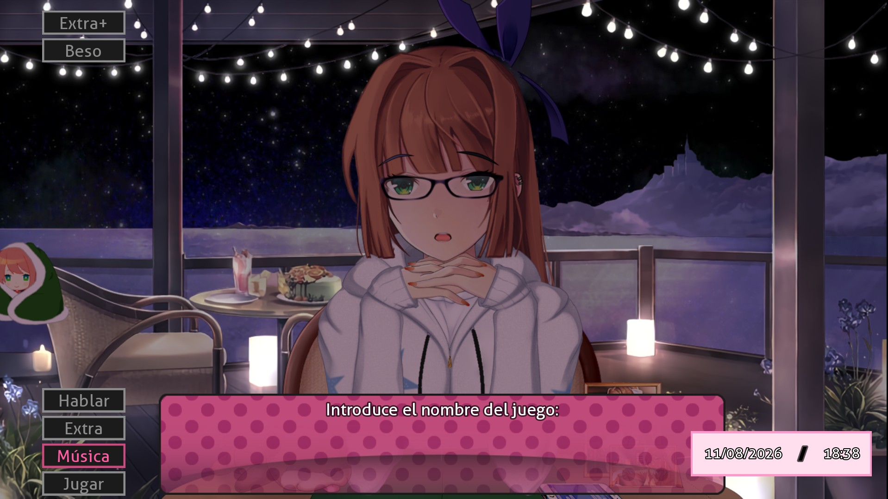

# Voy a Jugar un Juego Específico
### Submod para Monika After Story

 

  <em>Un submod que añade diálogos inmersivos para despedirte de Monika indicando con precisión a qué videojuego vas a jugar.</em>

[🎮 Lista de Juegos](JUEGOS.md) • [📥 Descargar](https://github.com/gg21kiy/Voy-a-jugar-un-juego-especifico-MAS-Submod/releases/latest) • [📁 Google Drive](https://drive.google.com/drive/folders/1wYFROsBtuH2lbA3kSD4yjvPBd18epTI1)

---

## 🌟 Características

* **Diálogos personalizados:** Respuestas únicas y variadas adaptadas al juego que elijas.
* **Gran catálogo:** Compatible con sagas populares como *GTA*, *FNAF*, *Resident Evil*, *Zelda*, *Pokémon*, *Club Penguin* y muchas más.
* **Soporte para Submod Updater Plugin:** Recibe avisos y actualiza el submod directamente desde el menú del juego sin configuraciones complicadas.
* **Corrección de errores:** Función `Vray Map` reparada y optimizada para la versión 1.5.0+.

---

## 🕹️ Instrucciones de Uso

1. En el menú de conversación con Monika, selecciona la siguiente ruta:
   > Hablar ➔ Adiós ➔ Voy a jugar un juego específico
2. Selecciona o escribe el título al que vas a jugar.
3. Monika reaccionará de manera única dependiendo de tu elección.

> [!TIP]
> Puedes consultar el catálogo completo de títulos admitidos en el archivo [**JUEGOS.md**](JUEGOS.md).

---

## 📦 Instalación

1. Dirígete a la sección de **[Releases](https://github.com/gg21kiy/Voy-a-jugar-un-juego-especifico-MAS-Submod/releases/latest)** y descarga el archivo `.zip` de la última versión.
2. Descomprime la carpeta del submod.
3. Copia el contenido dentro de la carpeta `game/Submods/` en tu directorio principal de **Monika After Story**.
4. Reinicia el juego si lo tenías abierto para aplicar los cambios.

### 🔄 Cómo Actualizar
* **Vía Submod Updater Plugin (Recomendado):** Si tienes este plugin instalado, el juego detectará automáticamente las nuevas versiones y podrás actualizar con un solo clic desde los ajustes de submods.
* **Vía Manual:** Descarga la nueva versión desde Releases, arrastra la carpeta a tu directorio `game/Submods/` y **reemplaza** los archivos existentes cuando tu sistema te lo pregunte.

### 🗑️ Desinstalación
Para eliminar el submod, simplemente borra su archivo correspondiente dentro del directorio `game/Submods/`.

---

## 🤝 Créditos y Agradecimientos

* Desarrollado por **[@gg21kiy](https://github.com/gg21kiy)**.
* Este submod surgió de la comunidad de **Encoders Club**. Únete a su servidor de Discord aquí: **[Discord de Encoders Club](https://discord.gg/UHFQS2CQe)**.
* Basado en la plataforma de **[Monika After Story](https://github.com/Monika-After-Story/MonikaModDev)**.
